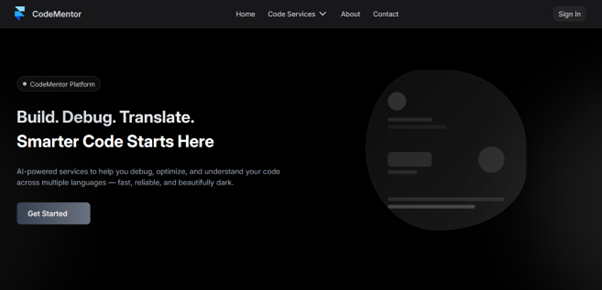
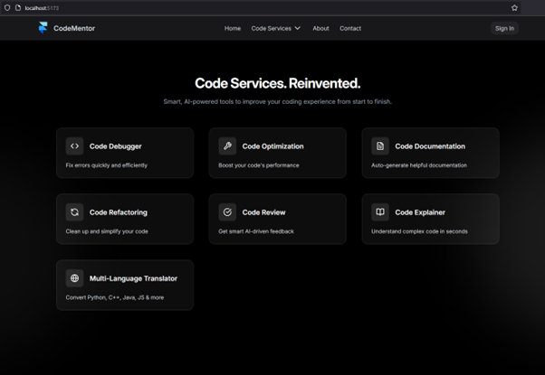
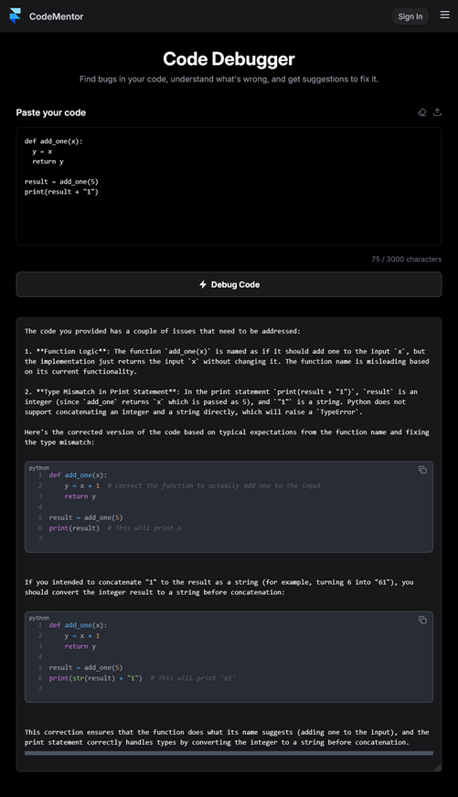
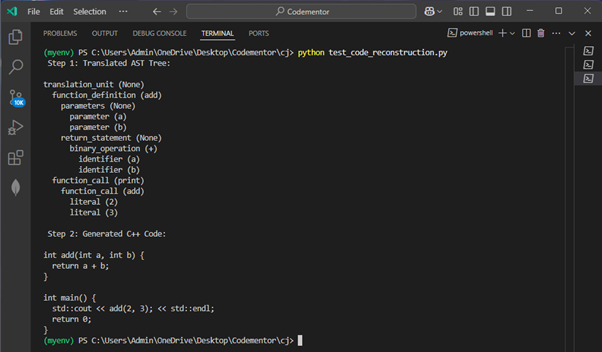
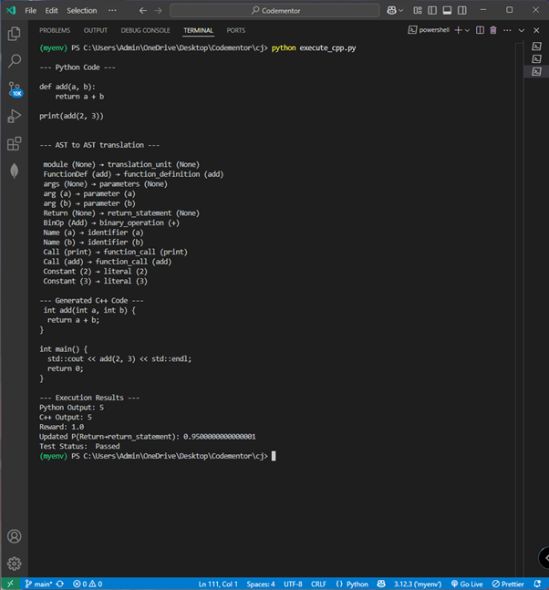
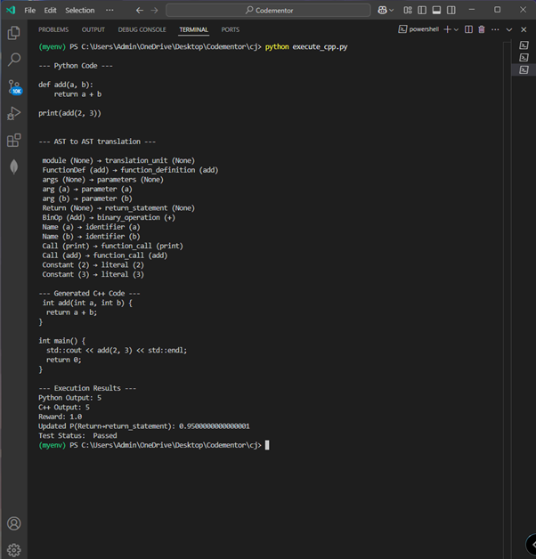

# CodeMentor: AI-Powered Code Assistance Platform

**CodeMentor** is an AI-driven software development assistant that automates and enhances key tasks like code translation, debugging, optimization, documentation, review, and explanation. It combines modern frontend/backend technologies with symbolic learning, Bayesian inference, and reinforcement learning to create a self-improving and explainable system for developers.

> ⚠️ This is a **public showcase version**. Full source code and implementation access is available upon request for academic or hiring purposes.

---

## Key Features

- 🔁 **Code Translator** – Converts Python code into C++ using:
  - 🧩 AST-based symbolic parsing
  - 📊 Bayesian probability mapping
  - 🎯 Execution-guided Reinforcement Learning
- 🐞 **Code Debugger** – Finds bugs with GPT-4 and explains fixes
- ⚡ **Code Optimizer** – Improves performance and reduces inefficiency
- 📚 **Code Documentation** – Generates function-level and module-level documentation
- 🔄 **Refactoring Tool** – Simplifies and restructures code cleanly
- 🧠 **Code Explainer** – Provides human-readable natural language explanations
- 🔍 **Code Reviewer** – Performs peer-like review with suggestions

---

## 🧠 Core Techniques

| 🧪 Technique | 📝 Description |
|-------------|----------------|
| **AST Parsing** | Converts Python code into structured Abstract Syntax Trees |
| **Bayesian Mapping** | Probabilistic translation using subjective logic  |
| **Reinforcement Learning** | Learns from real code execution using Q-learning principles  |
| **Execution Feedback** | Validates and compares translated C++ output with Python |
| **Fallback Handling** | Gracefully handles unsupported AST nodes |

---

## 🧱 System Architecture

📐 *(See project report or request full access for architecture diagrams.)*

---

## 🛠️ Tech Stack

| 🧩 Layer       | ⚙️ Technologies Used                             |
|---------------|--------------------------------------------------|
| 🎨 Frontend    | React.js (Vite), TailwindCSS, Javascript         |
| 🖥️ Backend     | Python, Flask, OpenAI API, Tree-sitter, ast     |
| 🧠 ML Logic    | Bayesian Learning, Reinforcement Learning       |
| 🧰 Dev Tools   | g++, Postman          |

---

## 🔁 Learning and Feedback Loop

For every translation:
- 🧪 Original Python code is executed.
- ⚙️ Translated C++ code is compiled and executed.
- 📊 Outputs are compared.
- ➕ A **+1 or -1 reward** is assigned.
- 🔁 The Bayesian map is updated using:  
  `P_new = P_old + α * reward` (α = 0.1)

---

## 📸 Screenshots

### 🔹 CodeMentor UI

### 🔹 Translation

### 🔹 Reconstruction

### 🔹 Reinforcement Reward 

---

## 🎓 Academic Details

- 👨‍🎓 **Author**: John Charles L  
- 🏫 **Institution**: Pondicherry University  
- 🎓 **Course**: Master of Science (Computer Science)  
- 📅 **Batch**: August 2023 - May 2025  
- ⏳ **Project Duration**: Feb 2025 - April 2025  

---

## 📩 Contact & Access

Want to see the full implementation?

📧 johncharles.steve@gmail.com  
🔗 [LinkedIn Profile](https://www.linkedin.com/in/-john-charles)  
🔒 Full repo access available upon request

---

## 🛑 License

© 2025 John Charles. All rights reserved.  
This project is protected under academic and personal IP.  
**🚫 Do not reuse, fork, or distribute without written permission.**
